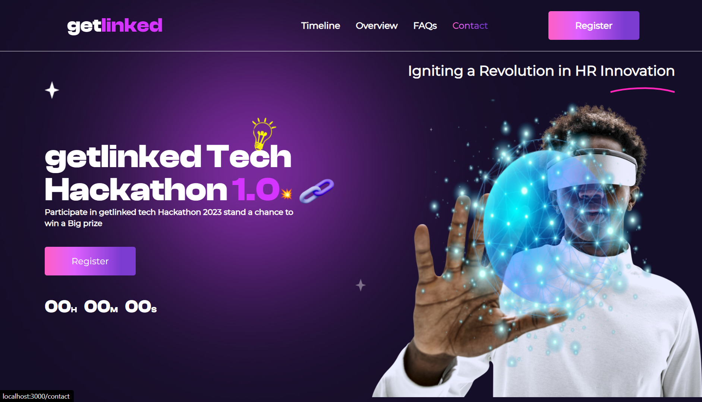

# Hackathon Getlinked Hackathon 1.0 LandingPage

## Table of contents

- [Overview](#overview)
  - [The features](#the-features)
  - [developers](#developers)
  - [Screenshot](#screenshot)
  - [Links](#links)
- [My process](#my-process)
  - [Built with](#built-with)

## Overview

### The features

UI Coding Challenge to Win N500k Cash or Laptop.💰💻🔥

As promised, I’ve got a coding challenge to develop a pixel perfect version of a landing page from a figma link.

http://getLinked.ai is proudly sponsoring this coding challenge and it’s open to all developers

### developers

- Frontend developer: [bamidele louis ](https://github.com/louis-bamidele)
- Frontend developer: [martins adepoju ](https://github.com/Martinsadepoju4)

### Screenshot

### Links

- Live Site URL: [live site](https://keen-tarsier-e8bfa2.netlify.app/)
- Figma design: [link to figma](<https://www.figma.com/file/OlP4rBgsrNVRZe5K6ADXck/Getlinked-(Copy)?type=design&node-id=0%3A1&mode=dev>)

## My process

### Built with

- React
- tailwind
- Motion Framer
- html5
- css3

